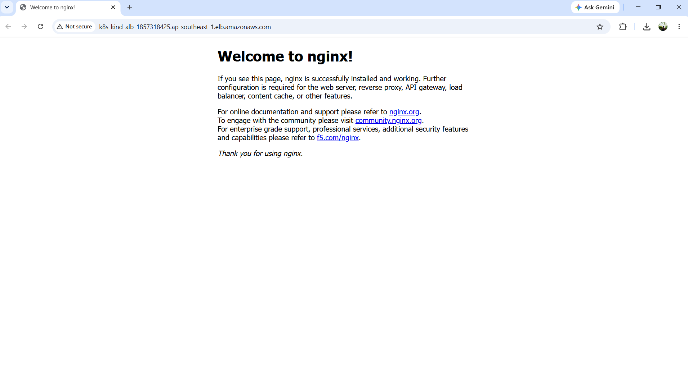
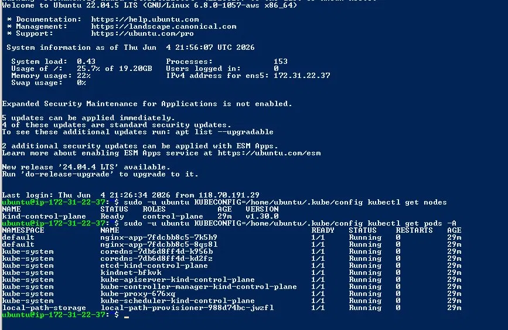

# K8s on AWS — Terraform

## Kiến trúc

```
Internet
    │
    ▼
ALB :80  (AWS Application Load Balancer)
    │
    ▼
EC2 :30080  (Ubuntu 22.04, t3.medium)
    │
    │  extraPortMappings (kind tự bridge)
    ▼
kind container (K8s cluster chạy trong Docker)
    │
    ▼
NodePort Service :30080
    │
    ▼
Nginx Pod :80  (2 replicas)
```

---

## Provider sử dụng

| Provider | Version | Mục đích |
|---|---|---|
| `hashicorp/aws` | ~> 5.0 | Tạo EC2, ALB, Security Group, Target Group |
| `hashicorp/null` | ~> 3.0 | SSH vào EC2, chờ K8s sẵn sàng trước khi tạo ALB |

### Cách wire 2 provider trong cùng 1 config

```hcl
# provider aws: tạo hạ tầng
provider "aws" {
  region = var.aws_region
}

# provider null: dùng remote-exec chờ K8s ready
resource "null_resource" "wait_for_k8s" {
  depends_on = [module.ec2]
  ...
}

# ALB chỉ tạo SAU KHI null_resource xác nhận K8s đã chạy
module "alb" {
  depends_on = [null_resource.wait_for_k8s]
  ...
}
```

`null` provider SSH vào EC2, chờ file `/tmp/k8s-ready` xuất hiện. File này được `user_data.sh` tạo ra khi K8s + app đã hoàn toàn sẵn sàng. Nhờ đó ALB health check pass ngay sau khi attach.

---

## Yêu cầu trước khi chạy

- Terraform >= 1.6
- AWS CLI đã configure (`aws configure`)
- Đã có EC2 Key Pair trên AWS, có file `.pem` trên máy
- AWS account có quyền tạo EC2, ALB, Security Group

---

## Cách chạy

### Bước 1: Clone repo và tạo file biến

```bash
cd k8s-terraform
```

Tạo file `terraform.tfvars`:

```hcl
key_name         = "k8s-key"
private_key_path = "~/.ssh/k8s-key.pem"
```

> Windows dùng đường dẫn: `private_key_path = "C:/Users/<yours>/.ssh/k8s-key.pem"`

### Bước 2: Chạy

```bash
terraform init
terraform plan
terraform apply -auto-approve
```

### Bước 3: Lấy URL app

```bash
terraform output app_url
```

Mở URL trên browser → thấy **"Welcome to nginx!"** là thành công.

> Sau khi apply xong, chờ thêm 2-3 phút để ALB health check pass lần đầu.



---

## Xem app chạy trong K8s

SSH vào EC2 để xác nhận:

```bash
ssh -i ~/.ssh/k8s-key.pem ubuntu@<ec2_public_ip>
```

Kiểm tra node:

```bash
sudo -u ubuntu KUBECONFIG=/home/ubuntu/.kube/config kubectl get nodes
```

Kiểm tra pods:

```bash
sudo -u ubuntu KUBECONFIG=/home/ubuntu/.kube/config kubectl get pods -A
```

**2 pod `nginx-app` ở namespace `default`** là app của bài tập, chạy thật trong K8s — không cài thẳng trên EC2.



---

## Dọn dẹp

```bash
terraform destroy -auto-approve
```

---

## Lý do thiết kế

### Dùng kind thay vì minikube

kind dùng `extraPortMappings` trong config để bridge port từ K8s NodePort ra thẳng EC2 host:

```yaml
extraPortMappings:
  - containerPort: 30080
    hostPort: 30080
```

Minikube với docker driver bị isolate network — phải chạy thêm `socat` (một process chuyển tiếp traffic thủ công) liên tục:

```bash
socat TCP-LISTEN:30080,fork TCP:${MINIKUBE_IP}:30080
```

Socat có thể crash, cần systemd giữ nó sống — phức tạp và dễ lỗi hơn. kind không cần bước này.

### null provider

Terraform tạo EC2 xong là coi như "done", nhưng EC2 vẫn đang boot và cài K8s bên trong. Nếu tạo ALB ngay lúc đó, health check sẽ fail vì app chưa chạy.

`null_resource` SSH vào EC2, đợi file `/tmp/k8s-ready` do `user_data.sh` tạo ra sau khi K8s hoàn toàn sẵn sàng. ALB chỉ được tạo sau đó → health check pass ngay.

### Default VPC

Đơn giản, có sẵn trên mọi AWS account, không cần tạo thêm VPC/subnet/internet gateway. Đảm bảo reproducible — ai chạy cũng có default VPC.

### NodePort 30080 cố định

ALB Target Group cần biết port cụ thể trước khi tạo. Nếu để K8s tự random port → ALB không biết forward vào đâu.

---

## Cấu trúc thư mục

```
k8s-terraform/
├── providers.tf          # Khai báo aws + null provider
├── main.tf               # Gọi module, chờ K8s, tạo ALB
├── variables.tf          # Biến: region, key_name, private_key_path
├── outputs.tf            # In URL sau khi deploy xong
├── terraform.tfvars      # Giá trị biến (không commit lên git)
└── modules/
    ├── ec2/
    │   ├── main.tf       # Tạo EC2, Security Group
    │   ├── variables.tf  # Nhận vpc_id, subnet_id, key_name
    │   ├── outputs.tf    # Xuất public_ip, instance_id
    │   └── user_data.sh  # Cài Docker, kind, kubectl, deploy nginx
    └── alb/
        ├── main.tf       # Tạo ALB, Target Group, Listener
        ├── variables.tf  # Nhận vpc_id, ec2_instance_id
        └── outputs.tf    # Xuất alb_dns_name
```
